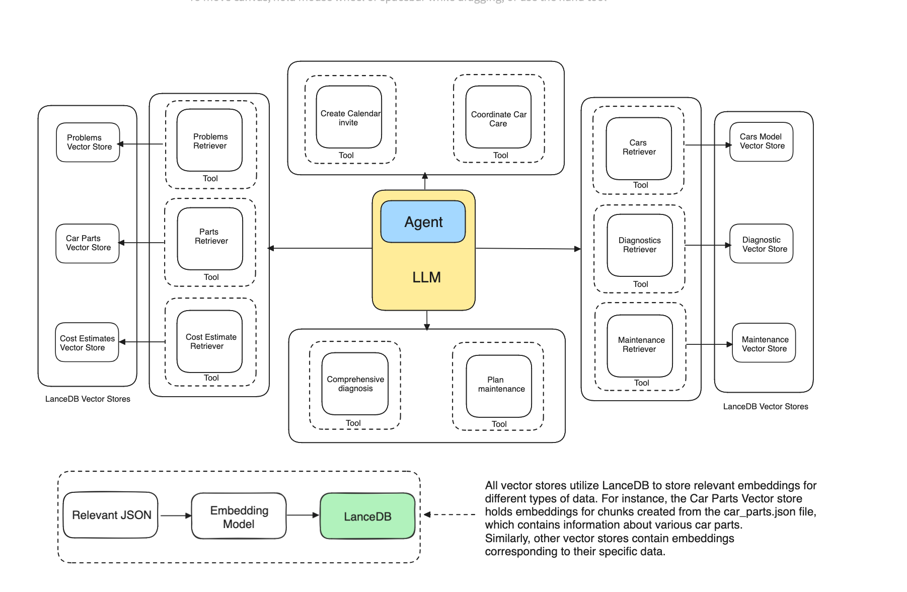

# Multidocument Agentic RAG



This example provides a comprehensive guide on creating a Multi-Document Agentic RAG leveraging the power of Embeddings and VectorDB. We'll explore how we can use Reasoning + Acting (ReAct) strategy to harness our RAG setup and make it more intelligent using different tools.


### Python
Run the script
```python
python3 -m venv .venv
source env/bin/activate
pip3 install -r requirements.txt
cd examples/multi-document-agentic-rag
python3 main.py
```